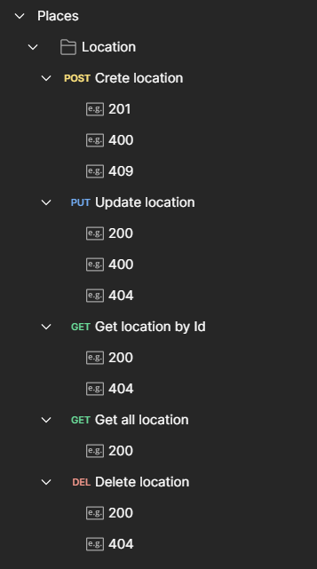

# Desafio de Backend


  - [Descrição](#descrição)
  - [Instalação](#instalação)
  - [Executando o projeto](#executando-o-projeto)
  - [Testes](#testes)
  - [Documentação](#documentação)
  - [Suporte](#suporte)
  - [Contato](#contato)

## Descrição
O desafio se consiste em desenvolver uma API Rest para alimentar o front-end abaixo:


Com base nas orientações do [desafio](https://github.com/ClubPetro/backend-challenge#requisitos-obrigat%C3%B3rios) a API foi desenvolvida com as seguintes tecnologias:
Node.Js, Express, Typescript, NestJS, TypeORM, PostgreSQL, Jest.

## Instalação

```bash
$ npm install
```

## Executando o projeto
Para execução do projeto é necessário configurar um banco de dados postgresql em sua máquina com as orientação do arquivo *env.example.yml*, presente na raiz do projeto.

```bash
# development
$ npm run start

# watch mode
$ npm run start:dev

# production mode
$ npm run start:prod
```

## Testes

```bash
# unit tests
$ npm run test

# test coverage
$ npm run test:cov
```

## Documentação

Os endpoist foram documentados via Swagger, execute o projeto e verifique a documentação por [aqui](http://localhost:3000/api/#/). Disponível também pelo link: http://localhost:3000/api/#/.


As collections estão inseridas na pasta *collection*, presente na raiz do projeto.

<div style="text-align: center;">
  
</div>

## Suporte

Entre em contato [aqui](https://github.com/arthur-cgomes) para suporte.

## Contato

- Desenvolvedor - [Arthur Gomes](https://github.com/arthur-cgomes)
- Linkedin - [Perfil profissional](https://www.linkedin.com/in/arthur-gomes-701549193/)

## Licença

SEM LICENÇA
